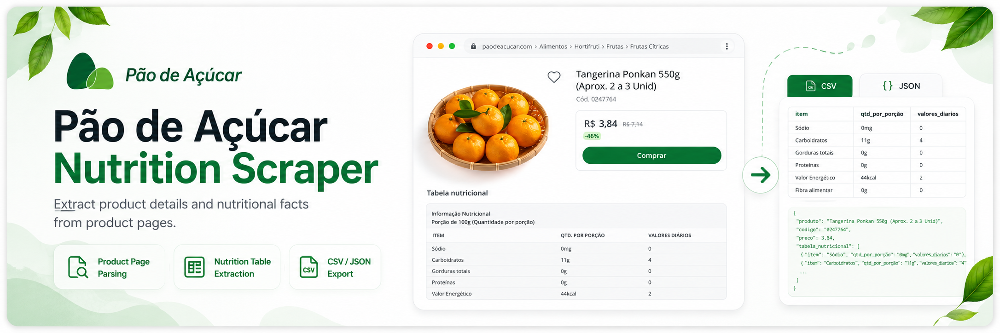
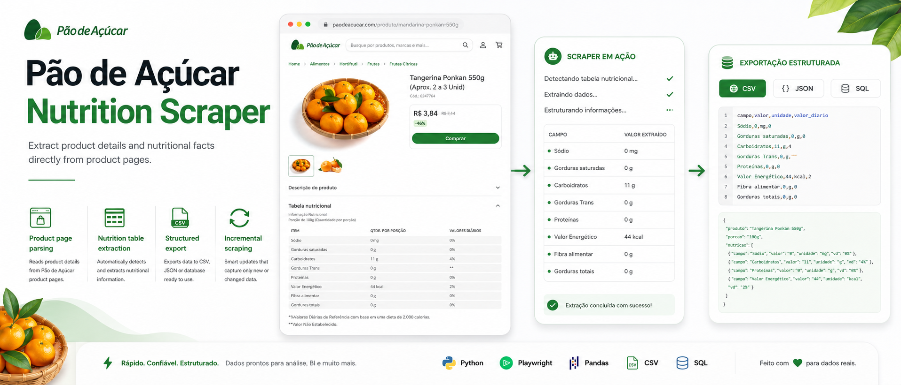

<p align="center">
  
</p>

<p align="center">
  <strong>Selenium · Beautiful Soup · Pandas · CLI</strong><br />
  <em>Automated collection of product-level nutritional facts from Pão de Açúcar’s e-commerce catalog.</em>
</p>

<p align="center">
  
</p>

<p align="center">
  <sub>Stack / tooling overview (graphic).</sub>
</p>

<p align="center">
  <a href="https://github.com/sidnei-almeida/pao_de_acucar_scraping"><strong>github.com/sidnei-almeida/pao_de_acucar_scraping</strong></a>
</p>

<p align="center">
  
  
</p>

---

## Overview

**Pão de Açúcar Scraping** is a **command-line toolkit** for harvesting **structured nutritional data** (macros, serving size, GTIN/EAN when available) from the **Pão de Açúcar** online store — useful for analytics, data-engineering portfolios, and reproducible scraping pipelines.

- **Interactive menu** or **argparse** subcommands for collection, query, export, and statistics.
- **Category-scoped runs** (16 top-level catalog slices), **test mode** for quick validation, and **checkpointed** long runs so large batches can survive interruptions.
- **Post-processing** with **pandas**: filters, stats, CSV/Excel export.

Deep-dive docs already in the repo: [CATEGORIES.md](CATEGORIES.md), [CATEGORY_SELECTION_GUIDE.md](CATEGORY_SELECTION_GUIDE.md), [CHECKPOINT_SYSTEM.md](CHECKPOINT_SYSTEM.md), [PRODUCT_FILTERING.md](PRODUCT_FILTERING.md), [BARCODES.md](BARCODES.md).

---

## Requirements

- **Python 3.11+** (see `.python-version`)
- **Google Chrome** or Chromium (managed via `webdriver-manager` / project browser setup)
- Stable network connection

---

## Install & run

```bash
git clone https://github.com/sidnei-almeida/pao_de_acucar_scraping.git
cd pao_de_acucar_scraping

python -m venv .venv
source .venv/bin/activate          # Windows: .venv\Scripts\activate

pip install -r requirements.txt
python main.py
```

### Non-interactive examples

```bash
python main.py listar-categorias
python main.py coletar --categorias 1 2 3 --teste
python main.py consultar --categoria "Produce"
python main.py exportar --formato excel
python main.py estatisticas
```

CLI flags and behavior are defined in `main.py` — use `--help` on subcommands for the full list.

---

## What gets collected

Per product (when available on the page): name, category, URL, **barcode**, serving size, **calories**, carbohydrates, protein, fats (incl. saturated), fiber, sugars, sodium, collection metadata, and validation flags. Entries **without** usable nutrition panels can be **filtered out** automatically — see [PRODUCT_FILTERING.md](PRODUCT_FILTERING.md).

Output files typically live under **`dados_coletados/`**; logs under **`logs/`** when enabled by the run.

---

## Categories (summary)

16 selectable groups — from perishable (produce, seafood, rotisserie) to pantry, frozen, beverages, consolidated “Food (all)”, and **Caras do Brasil**. Full naming and numbering: [CATEGORIES.md](CATEGORIES.md).

---

## Repository layout

| Path | Role |
|------|------|
| `main.py` | CLI entry, menus, argument parsing, orchestration. |
| `scraper.py` | Page-level scraping and parsing. |
| `url_collector.py` | Category URL discovery / queue building. |
| `browser_config.py` | WebDriver / browser configuration. |
| `scraping_log.py` | Logging helpers. |
| `list_categories.py` / `verify_categories.py` | Utilities for catalog verification. |
| `coleta_multipla.py` | Optional batch patterns (if used in your workflow). |
| `dados_coletados/` | Generated CSV / Excel (not all committed — depends on your `.gitignore`). |
| `images/header.png` | README header banner. |
| `images/software.png` | Stack / tooling graphic. |

---

## Dependencies

Pinned in **`requirements.txt`**: Selenium, `webdriver-manager`, Beautiful Soup, pandas, XlsxWriter / openpyxl stack.

---

## Ethics & legal notice

This software is provided for **education and personal research**. You are responsible for complying with **Pão de Açúcar / GPA** terms of service, **robots** directives, applicable **data-protection** and **consumer** laws, and for using reasonable **rate limits**. Do not redistribute scraped product data in ways that violate those terms or third-party rights.

---

## Author

**Sidnei Alves de Almeida** — [@sidnei-almeida](https://github.com/sidnei-almeida) · [LinkedIn](https://www.linkedin.com/in/saaelmeida93/)

Questions or issues: [GitHub Issues](https://github.com/sidnei-almeida/pao_de_acucar_scraping/issues).
